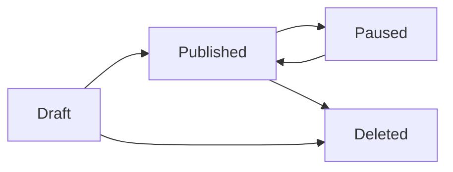

## Overview

The Gig Marketplace is where freelancers showcase their services as purchasable offerings called "gigs." Each gig represents a specific service with defined deliverables, pricing, and timelines. Clients can browse gigs by category, compare packages, and place orders directly.

## Key Capabilities

### Gig Creation & Management

Freelancers have complete control over their service offerings:

- **Draft System**: Start creating gigs and save progress before publishing
- **Rich Descriptions**: Use formatted text to describe services in detail
- **Media Gallery**: Upload images, videos, and documents to showcase work
- **Status Control**: Publish, pause, or delete gigs as needed
- **Category Organization**: Classify gigs in categories and subcategories
- **Tag System**: Add searchable tags to improve discoverability

### Flexible Pricing with Packages

<Info>
  Gigs can offer a single package or multiple tiers to cater to different client needs and budgets.
</Info>

Each package includes:
- **Name**: Descriptive package title (e.g., "Basic Logo Design")
- **Price**: Service cost in the platform currency
- **Description**: What's included in the package
- **Delivery Time**: Days until completion
- **Revisions**: Number of revision rounds included

<Tabs>
  <Tab title="Single Package">
    Offer one straightforward option for clients who want simplicity.
    
    Best for:
    - Simple, standardized services
    - Fixed-scope projects
    - Clear deliverables
  </Tab>
  
  <Tab title="Multiple Packages">
    Provide three tiers (Basic, Standard, Premium) to give clients choices.
    
    Best for:
    - Services with varying complexity
    - Upselling opportunities
    - Flexible client budgets
  </Tab>
</Tabs>

### FAQs & Details

Address common questions upfront:
- Add multiple FAQ entries with questions and answers
- Reduce back-and-forth communication
- Set clear expectations for clients

## User Workflows

### For Freelancers

<Steps>
  <Step title="Create Draft">
    Start a new gig in draft status to work on it without publishing.
  </Step>
  
  <Step title="Set Overview">
    Add a compelling title, select category and subcategory, and add relevant tags for discoverability.
  </Step>
  
  <Step title="Configure Packages">
    Choose single or multiple package offering. Define pricing, delivery time, and revision counts for each tier.
  </Step>
  
  <Step title="Write Description">
    Craft a detailed service description explaining what clients will receive, your process, and why they should choose you.
  </Step>
  
  <Step title="Add FAQs">
    Answer common questions to reduce client uncertainty and objections.
  </Step>
  
  <Step title="Upload Gallery">
    Add images, videos, or documents that showcase your work quality and style.
  </Step>
  
  <Step title="Publish">
    When ready, publish the gig to make it visible in the marketplace. A unique slug is automatically generated from your title.
  </Step>
</Steps>

<Note>
  After publishing, your gig is accessible at `/profile/[username]/gig/[slug]`
</Note>

### For Clients

<Steps>
  <Step title="Browse Marketplace">
    Search gigs by category, tags, or keywords. Filter by price, delivery time, or freelancer ratings.
  </Step>
  
  <Step title="Review Gig Details">
    Read the description, view the gallery, check packages, and read FAQs to understand the service.
  </Step>
  
  <Step title="Check Freelancer Profile">
    View the freelancer's rating, reviews, skills, and other gigs to assess reliability.
  </Step>
  
  <Step title="Select Package">
    Choose the package that fits your needs and budget (Basic, Standard, or Premium).
  </Step>
  
  <Step title="Place Order">
    Complete the purchase to start working with the freelancer.
  </Step>
</Steps>

## Important Fields

### Gig Model

<ResponseField name="title" type="string">
  Service title shown in marketplace listings
</ResponseField>

<ResponseField name="slug" type="string">
  URL-friendly identifier auto-generated from title
</ResponseField>

<ResponseField name="description" type="json">
  Rich text description of the service offering
</ResponseField>

<ResponseField name="status" type="enum">
  Current state: draft, published, paused, or deleted
</ResponseField>

<ResponseField name="offersMultiplePackages" type="boolean">
  Whether gig has one package or three tiers
</ResponseField>

<ResponseField name="categoryId" type="string">
  Reference to category (usually subcategory)
</ResponseField>

<ResponseField name="ownerId" type="string">
  Freelancer who created the gig
</ResponseField>

### Package Model

<ResponseField name="name" type="string" required>
  Package title (e.g., "Basic", "Standard", "Premium")
</ResponseField>

<ResponseField name="price" type="float" required>
  Cost of this package
</ResponseField>

<ResponseField name="description" type="string" required>
  What's included in this package
</ResponseField>

<ResponseField name="delivery" type="integer" required>
  Days until delivery
</ResponseField>

<ResponseField name="revisions" type="integer" required>
  Number of revision rounds included
</ResponseField>

<ResponseField name="type" type="enum" required>
  Package tier: basic, standard, or premium
</ResponseField>

### Related Models

<ResponseField name="tags" type="GigTag[]">
  Searchable tags for gig discovery
</ResponseField>

<ResponseField name="faqs" type="GigFaq[]">
  Frequently asked questions with answers
</ResponseField>

<ResponseField name="attachments" type="Attachement[]">
  Gallery images, videos, and documents
</ResponseField>

## Gig Status Lifecycle

- **Draft**: Work in progress, not visible to clients
- **Published**: Live in marketplace, accepting orders
- **Paused**: Temporarily hidden (not accepting new orders)
- **Deleted**: Removed from platform

## Related Features

<CardGroup cols={2}>
  <Card title="Freelancer Profiles" icon="user" href="/features/freelancer-profiles">
    Build your professional profile
  </Card>
  
  <Card title="Orders & Payments" icon="credit-card" href="/features/orders-payments">
    Manage incoming orders
  </Card>
  
  <Card title="Reviews & Ratings" icon="star" href="/features/reviews-ratings">
    Receive client feedback
  </Card>
  
  <Card title="Messaging" icon="message" href="/features/messaging">
    Answer client questions
  </Card>
</CardGroup>

<Warning>
  Published gigs must have a title, at least one package, and meet quality standards. Ensure all required fields are complete before publishing.
</Warning>