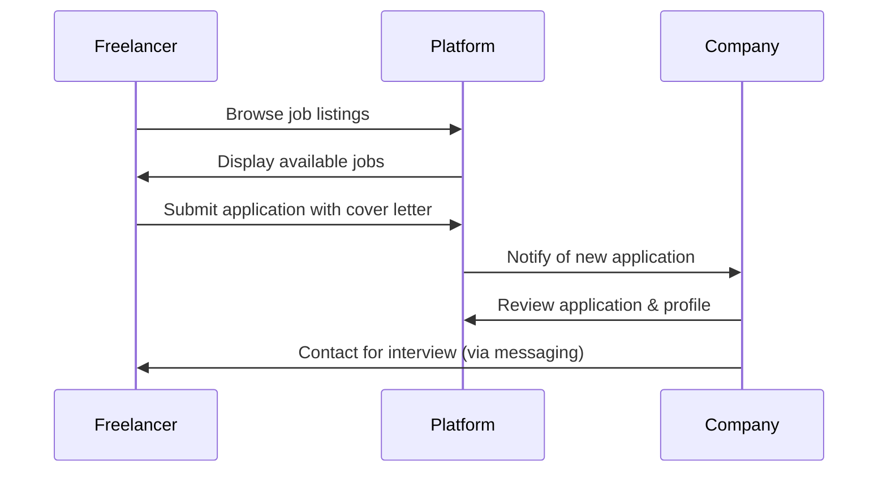

## Overview

Job Postings allow companies to advertise open positions and receive applications from qualified freelancers. Unlike the gig marketplace where freelancers create offerings, job postings are created by clients seeking specific talent for projects or roles.

## Key Capabilities

### For Companies

<CardGroup cols={2}>
  <Card title="Post Jobs" icon="plus">
    Create detailed job listings with requirements, budget, and project details
  </Card>
  
  <Card title="Manage Applications" icon="inbox">
    Review applications, cover letters, and freelancer profiles
  </Card>
  
  <Card title="Company Profiles" icon="building">
    Establish company presence with logo, description, and contact info
  </Card>
  
  <Card title="Track Listings" icon="list">
    View all active job postings and their application counts
  </Card>
</CardGroup>

### For Freelancers

<CardGroup cols={2}>
  <Card title="Browse Opportunities" icon="search">
    Explore jobs filtered by type, location, and requirements
  </Card>
  
  <Card title="Submit Applications" icon="paper-plane">
    Apply with custom cover letters tailored to each job
  </Card>
  
  <Card title="Remote Options" icon="laptop">
    Find remote-friendly positions across the platform
  </Card>
  
  <Card title="Track Applications" icon="clock">
    Monitor submitted applications and their status
  </Card>
</CardGroup>

## User Workflows

### Company: Creating a Job Posting

<Steps>
  <Step title="Set Up Company Profile">
    Before posting jobs, create a company profile with:
    - Company name and logo
    - Industry and location
    - Description and mission
    - Contact email and website
  </Step>
  
  <Step title="Create Job Listing">
    Fill out the job posting form:
    - **Title**: Clear job or project title
    - **Type**: Full-time, part-time, contract, or intern
    - **Description**: Detailed project scope or role responsibilities (supports rich text)
    - **Location**: Physical location or "Remote"
    - **Remote Option**: Toggle if remote work is allowed
    - **Salary**: Budget or salary range (optional)
  </Step>
  
  <Step title="Publish">
    Submit the job posting to make it visible to freelancers. A unique slug is auto-generated for the URL.
  </Step>
  
  <Step title="Review Applications">
    As applications arrive, review:
    - Freelancer profiles and credentials
    - Custom cover letters
    - Skills and experience
    - Previous ratings and reviews
  </Step>
</Steps>

### Freelancer: Applying to Jobs

<Steps>
  <Step title="Browse Job Listings">
    Search available jobs using filters:
    - Job type (full-time, contract, etc.)
    - Location and remote options
    - Company and industry
    - Posted date
  </Step>
  
  <Step title="Review Job Details">
    Read the full job description, requirements, company profile, and salary information.
  </Step>
  
  <Step title="Prepare Application">
    Write a tailored cover letter that:
    - Addresses the specific job requirements
    - Highlights relevant skills and experience
    - Explains why you're a great fit
    - References your portfolio or past work
  </Step>
  
  <Step title="Submit Application">
    Send your application with the cover letter. Your profile information is automatically included for the company to review.
  </Step>
</Steps>

## Important Fields

### Job Model

<ResponseField name="title" type="string" required>
  Job or project title
</ResponseField>

<ResponseField name="slug" type="string" required>
  Auto-generated URL identifier from title
</ResponseField>

<ResponseField name="description" type="json" required>
  Rich text job description with requirements and details
</ResponseField>

<ResponseField name="type" type="enum" required>
  Job type: full_time, part_time, contract, or intern
</ResponseField>

<ResponseField name="location" type="string" required>
  Physical location or city
</ResponseField>

<ResponseField name="canBeRemote" type="boolean" required>
  Whether remote work is permitted
</ResponseField>

<ResponseField name="salary" type="string">
  Salary range or project budget (optional)
</ResponseField>

<ResponseField name="companyId" type="string" required>
  Company posting the job
</ResponseField>

### Application Model

<ResponseField name="jobId" type="string" required>
  The job being applied to
</ResponseField>

<ResponseField name="userId" type="string" required>
  Freelancer submitting the application
</ResponseField>

<ResponseField name="coverLetter" type="text" required>
  Custom cover letter written by the applicant
</ResponseField>

<ResponseField name="createdAt" type="datetime">
  Application submission timestamp
</ResponseField>

### Company Model

<ResponseField name="name" type="string" required>
  Company name
</ResponseField>

<ResponseField name="logo" type="text" required>
  URL to company logo image
</ResponseField>

<ResponseField name="industry" type="string" required>
  Company's industry or sector
</ResponseField>

<ResponseField name="location" type="string" required>
  Company headquarters location
</ResponseField>

<ResponseField name="description" type="text" required>
  About the company
</ResponseField>

<ResponseField name="contactEmail" type="string" required>
  Primary contact email
</ResponseField>

<ResponseField name="website" type="string">
  Company website URL (optional)
</ResponseField>

<ResponseField name="userId" type="string" required>
  User account managing the company
</ResponseField>

## Job Types Explained

<AccordionGroup>
  <Accordion title="Full-Time">
    Traditional full-time employment with regular hours and long-term commitment.
    
    Typical characteristics:
    - 40+ hours per week
    - Long-term position
    - May include benefits
  </Accordion>
  
  <Accordion title="Part-Time">
    Reduced hours with flexible scheduling.
    
    Typical characteristics:
    - Less than 40 hours per week
    - Flexible schedule
    - May be ongoing or temporary
  </Accordion>
  
  <Accordion title="Contract">
    Project-based or fixed-term engagement.
    
    Typical characteristics:
    - Defined start and end dates
    - Specific deliverables
    - Independent contractor status
  </Accordion>
  
  <Accordion title="Intern">
    Learning opportunity for students or career changers.
    
    Typical characteristics:
    - Training and mentorship
    - Fixed duration
    - May be paid or unpaid
  </Accordion>
</AccordionGroup>

## Application Workflow

## Related Features

<CardGroup cols={2}>
  <Card title="Freelancer Profiles" icon="user" href="/features/freelancer-profiles">
    Build profile to showcase qualifications
  </Card>
  
  <Card title="Messaging" icon="message" href="/features/messaging">
    Communicate with companies
  </Card>
  
  <Card title="Gig Marketplace" icon="store" href="/features/gig-marketplace">
    Alternative: Offer your services as gigs
  </Card>
  
  <Card title="Reviews & Ratings" icon="star" href="/features/reviews-ratings">
    Build reputation to strengthen applications
  </Card>
</CardGroup>

<Info>
  Job postings are separate from gigs. Gigs are freelancer-created service offerings, while jobs are company-posted opportunities that require applications.
</Info>