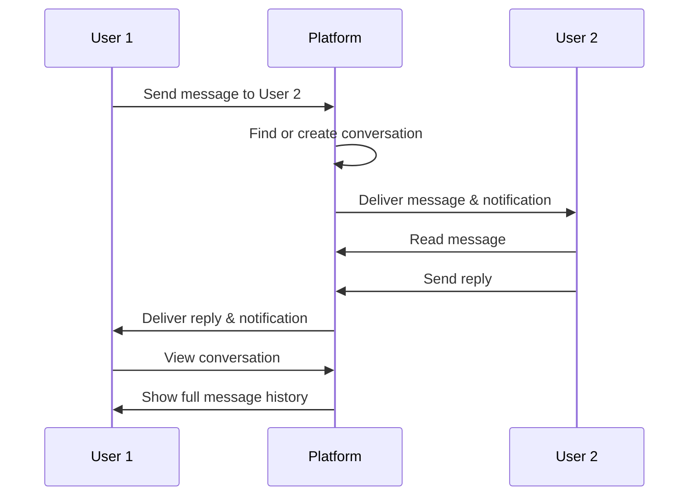

## Overview

The messaging system enables real-time communication between users on Khedma Market. Freelancers and clients can discuss project details, clarify requirements, negotiate terms, and maintain ongoing communication throughout their working relationship.

## Key Capabilities

### Conversation Management

<CardGroup cols={2}>
  <Card title="Direct Messages" icon="comment">
    One-on-one conversations between two users
  </Card>
  
  <Card title="Conversation History" icon="clock-rotate-left">
    Access complete message history with timestamps
  </Card>
  
  <Card title="File Attachments" icon="paperclip">
    Share documents, images, and files within messages
  </Card>
  
  <Card title="Inbox Organization" icon="inbox">
    View all conversations with the most recent at the top
  </Card>
</CardGroup>

### Communication Features

- **Auto-created Conversations**: Conversations are automatically created when users first message each other
- **Bidirectional Messaging**: Both sender and receiver can view the same conversation thread
- **Attachment Support**: Send documents and files alongside messages
- **Real-time Updates**: Messages appear instantly for responsive communication
- **Notification Control**: Users can toggle inbox notifications on/off

## User Workflows

### Starting a Conversation

<Steps>
  <Step title="Find a User">
    Navigate to a freelancer's profile, gig page, or job posting to initiate contact.
  </Step>
  
  <Step title="Start Messaging">
    Click the "Contact" or "Message" button. The platform automatically creates a conversation if one doesn't exist.
  </Step>
  
  <Step title="Send Your Message">
    Type your message in the text field. Ask questions, discuss requirements, or introduce yourself.
  </Step>
  
  <Step title="Attach Files (Optional)">
    Upload relevant documents, portfolio samples, or reference materials to support your message.
  </Step>
  
  <Step title="Continue the Conversation">
    Both parties receive notifications and can reply. The conversation remains accessible in the inbox for future reference.
  </Step>
</Steps>

### Managing Your Inbox

<Tabs>
  <Tab title="View Conversations">
    Access your inbox to see all active conversations. Each conversation shows:
    - The other user's name and profile picture
    - Last message preview
    - Timestamp of last activity
    - Unread message indicators
  </Tab>
  
  <Tab title="Search & Filter">
    Find specific conversations by:
    - User name or username
    - Recent activity
    - Message content
  </Tab>
  
  <Tab title="Message History">
    Click into any conversation to view:
    - Full message history in chronological order
    - Who sent each message
    - Timestamps for each message
    - Attached files and documents
  </Tab>
</Tabs>

## Common Use Cases

<AccordionGroup>
  <Accordion title="Pre-Purchase Questions" icon="question">
    Clients can message freelancers before ordering to:
    - Clarify gig details and deliverables
    - Discuss custom requirements
    - Confirm availability and timeline
    - Negotiate pricing for custom work
  </Accordion>
  
  <Accordion title="Project Communication" icon="comments">
    During active projects, use messaging to:
    - Share project files and resources
    - Request revisions or clarifications
    - Provide feedback and updates
    - Coordinate delivery timelines
  </Accordion>
  
  <Accordion title="Job Applications" icon="briefcase">
    After applying to jobs, companies may reach out via messaging to:
    - Schedule interviews
    - Request additional information
    - Discuss terms and expectations
    - Make offers
  </Accordion>
  
  <Accordion title="Post-Project Follow-up" icon="handshake">
    After project completion:
    - Request or provide reviews
    - Discuss future collaboration
    - Address any final questions
    - Build long-term relationships
  </Accordion>
</AccordionGroup>

## Important Fields

### Conversation Model

<ResponseField name="id" type="string">
  Unique conversation identifier
</ResponseField>

<ResponseField name="senderId" type="string" required>
  User who initiated the conversation
</ResponseField>

<ResponseField name="receiverId" type="string" required>
  User who received the conversation
</ResponseField>

<ResponseField name="createdAt" type="datetime">
  When the conversation was created
</ResponseField>

<ResponseField name="updatedAt" type="datetime">
  Last activity timestamp
</ResponseField>

<ResponseField name="messages" type="Message[]">
  All messages in the conversation
</ResponseField>

### Message Model

<ResponseField name="id" type="string">
  Unique message identifier
</ResponseField>

<ResponseField name="content" type="text" required>
  Message text content
</ResponseField>

<ResponseField name="conversationId" type="string" required>
  Parent conversation
</ResponseField>

<ResponseField name="userId" type="string" required>
  User who sent the message
</ResponseField>

<ResponseField name="attachements" type="Attachement[]">
  Files attached to this message
</ResponseField>

<ResponseField name="createdAt" type="datetime">
  When the message was sent
</ResponseField>

### Attachment Model

<ResponseField name="name" type="string" required>
  Original filename
</ResponseField>

<ResponseField name="url" type="string" required>
  URL to access the file
</ResponseField>

<ResponseField name="type" type="string" required>
  File type (typically "document" for message attachments)
</ResponseField>

<ResponseField name="messageId" type="string">
  Message this attachment belongs to
</ResponseField>

## How Conversations Work

<Info>
  Conversations are bidirectional - both users see the same message thread and can send messages at any time.
</Info>

## Notification Settings

Users can control messaging notifications in their account settings:

<ResponseField name="inboxNotifications" type="boolean" default={true}>
  Toggle to enable/disable notifications for new messages
</ResponseField>

<ResponseField name="orderUpdatesNotifications" type="boolean" default={true}>
  Toggle to enable/disable notifications for order-related messages
</ResponseField>

## Privacy & Best Practices

<Warning>
  Keep all communication on the platform to protect both parties:
  - Messages are recorded for dispute resolution
  - Contact information is protected
  - Platform can moderate inappropriate behavior
</Warning>

**Best Practices for Professional Communication:**

- Be clear and specific about requirements
- Respond in a timely manner
- Keep conversations professional
- Use attachments to share detailed information
- Confirm agreements in writing
- Respect time zones and availability

## Related Features

<CardGroup cols={2}>
  <Card title="Freelancer Profiles" icon="user" href="/features/freelancer-profiles">
    View profiles before messaging
  </Card>
  
  <Card title="Gig Marketplace" icon="store" href="/features/gig-marketplace">
    Message freelancers about their gigs
  </Card>
  
  <Card title="Job Postings" icon="briefcase" href="/features/job-postings">
    Communicate about job opportunities
  </Card>
  
  <Card title="Orders & Payments" icon="credit-card" href="/features/orders-payments">
    Discuss active orders and deliveries
  </Card>
</CardGroup>