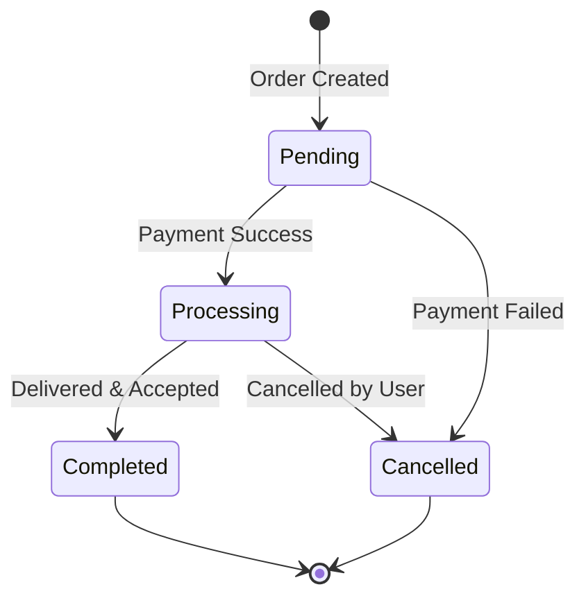

## Overview

The Orders & Payments system handles the complete transaction lifecycle from purchase to payment. When clients order gigs, the platform manages order tracking, payment processing, and fund disbursement to ensure secure and reliable transactions for both parties.

## Key Capabilities

### Order Management

<CardGroup cols={2}>
  <Card title="Order Tracking" icon="list-check">
    Monitor order status from placement to completion
  </Card>
  
  <Card title="Package Selection" icon="box">
    Orders are tied to specific gig packages (Basic, Standard, or Premium)
  </Card>
  
  <Card title="Order History" icon="clock-rotate-left">
    View complete purchase history with timestamps
  </Card>
  
  <Card title="Status Updates" icon="bell">
    Receive notifications when order status changes
  </Card>
</CardGroup>

### Payment Processing

<CardGroup cols={2}>
  <Card title="Secure Transactions" icon="shield">
    Integrated payment gateway for secure processing
  </Card>
  
  <Card title="Multiple Methods" icon="wallet">
    Support for various payment methods
  </Card>
  
  <Card title="Transaction Records" icon="receipt">
    Complete payment history with transaction IDs
  </Card>
  
  <Card title="Payment Status" icon="circle-check">
    Track payment state (pending, success, failed)
  </Card>
</CardGroup>

## Order Lifecycle

<Steps>
  <Step title="Order Placement">
    Client selects a gig package and places an order. The order is created with:
    - Selected package details
    - Total amount from package price
    - Initial status: **Pending**
  </Step>
  
  <Step title="Payment Processing">
    The payment is processed through the integrated gateway:
    - Payment record is created
    - Status: **Pending**
    - Transaction ID is recorded once processed
  </Step>
  
  <Step title="Order Confirmation">
    Once payment succeeds:
    - Payment status: **Success**
    - Order status: **Processing**
    - Freelancer is notified to begin work
  </Step>
  
  <Step title="Service Delivery">
    Freelancer completes the work according to package terms:
    - Delivery within the specified timeframe
    - Revisions handled as per package
    - Order status remains **Processing**
  </Step>
  
  <Step title="Order Completion">
    When both parties agree work is complete:
    - Order status: **Completed**
    - Funds are released to freelancer
    - Client can leave a review
  </Step>
</Steps>

### Order Status Flow

## User Workflows

### For Clients

<Tabs>
  <Tab title="Placing an Order">
    1. Browse the gig marketplace
    2. Select a gig that matches your needs
    3. Choose a package (Basic, Standard, or Premium)
    4. Review deliverables, price, and timeline
    5. Proceed to checkout
    6. Complete payment with preferred method
    7. Receive order confirmation
  </Tab>
  
  <Tab title="Tracking Orders">
    1. Access your orders dashboard
    2. View all active and past orders
    3. Check order status (Pending, Processing, Completed)
    4. Monitor delivery timelines
    5. Receive notifications for status changes
    6. Communicate with freelancer via messaging
  </Tab>
  
  <Tab title="After Delivery">
    1. Review delivered work
    2. Request revisions if included in package
    3. Accept delivery when satisfied
    4. Order status changes to Completed
    5. Leave a review and rating
    6. Access delivered files anytime
  </Tab>
</Tabs>

### For Freelancers

<Tabs>
  <Tab title="Receiving Orders">
    1. Receive notification of new order
    2. Review order details and package
    3. Check client requirements
    4. Confirm order acceptance
    5. Begin work according to timeline
  </Tab>
  
  <Tab title="Managing Orders">
    1. View all active orders in dashboard
    2. Track delivery deadlines
    3. Update clients on progress
    4. Upload deliverables when complete
    5. Handle revision requests within package limits
  </Tab>
  
  <Tab title="Completing Orders">
    1. Deliver final work to client
    2. Mark order as delivered
    3. Wait for client acceptance
    4. Receive payment when order completes
    5. Respond to client review (optional)
  </Tab>
</Tabs>

## Important Fields

### Order Model

<ResponseField name="id" type="string">
  Unique order identifier
</ResponseField>

<ResponseField name="userId" type="string" required>
  Client who placed the order
</ResponseField>

<ResponseField name="gigId" type="string" required>
  Gig being purchased
</ResponseField>

<ResponseField name="packageId" type="string" required>
  Specific package selected (Basic, Standard, or Premium)
</ResponseField>

<ResponseField name="status" type="enum" required>
  Current order status: pending, processing, completed, or cancelled
</ResponseField>

<ResponseField name="totalAmount" type="float" required>
  Order total (from package price)
</ResponseField>

<ResponseField name="createdAt" type="datetime">
  When the order was placed
</ResponseField>

<ResponseField name="updatedAt" type="datetime">
  Last status update timestamp
</ResponseField>

### Payment Model

<ResponseField name="id" type="string">
  Unique payment identifier
</ResponseField>

<ResponseField name="orderId" type="string" required>
  Associated order (one-to-one relationship)
</ResponseField>

<ResponseField name="status" type="enum" required>
  Payment status: pending, success, or failed
</ResponseField>

<ResponseField name="amount" type="float" required>
  Payment amount (matches order total)
</ResponseField>

<ResponseField name="paymentMethod" type="string" required>
  Method used for payment (credit card, PayPal, etc.)
</ResponseField>

<ResponseField name="transactionId" type="string">
  Gateway transaction reference ID
</ResponseField>

<ResponseField name="createdAt" type="datetime">
  Payment initiation timestamp
</ResponseField>

<ResponseField name="updatedAt" type="datetime">
  Last payment status update
</ResponseField>

## Order Status Definitions

<AccordionGroup>
  <Accordion title="Pending" icon="clock">
    **Initial state** when order is first created.
    
    Characteristics:
    - Payment is being processed
    - Order awaiting confirmation
    - No work has started
    
    Next states: Processing (payment success) or Cancelled (payment failure)
  </Accordion>
  
  <Accordion title="Processing" icon="spinner">
    **Active state** when freelancer is working on the order.
    
    Characteristics:
    - Payment succeeded
    - Freelancer is delivering the service
    - Work in progress
    - Revisions may be requested
    
    Next states: Completed (delivered & accepted) or Cancelled (by agreement)
  </Accordion>
  
  <Accordion title="Completed" icon="circle-check">
    **Final success state** when order is fulfilled.
    
    Characteristics:
    - Work delivered and accepted
    - Funds released to freelancer
    - Client can leave review
    - Order is closed
    
    This is a terminal state.
  </Accordion>
  
  <Accordion title="Cancelled" icon="circle-xmark">
    **Final cancelled state** when order doesn't complete.
    
    Reasons:
    - Payment failed
    - Mutual agreement to cancel
    - Policy violation
    
    Characteristics:
    - Work stops immediately
    - Refund processed if applicable
    - Order is closed
    
    This is a terminal state.
  </Accordion>
</AccordionGroup>

## Payment Integration

The platform uses YouCanPay for payment processing:

1. **Tokenization**: Payment details are tokenized for security
2. **Transaction Processing**: Payments are processed through the gateway
3. **Status Tracking**: Real-time payment status updates
4. **Transaction Records**: Complete payment history maintained

<Info>
  The platform supports the Moroccan Dirham (MAD) as the primary currency for transactions.
</Info>

## Notification Preferences

Users can control order-related notifications:

<ResponseField name="orderUpdatesNotifications" type="boolean" default={true}>
  Receive notifications for order status changes, messages, and updates
</ResponseField>

Notifications are sent for:
- New orders received (freelancers)
- Order status changes
- Delivery confirmations
- Payment confirmations
- Review requests

## Best Practices

<CardGroup cols={2}>
  <Card title="For Clients" icon="user-tie">
    - Clearly communicate requirements
    - Respond promptly to freelancer questions
    - Review deliverables within reasonable time
    - Request revisions respectfully
    - Leave honest reviews
  </Card>
  
  <Card title="For Freelancers" icon="user">
    - Deliver within promised timeframe
    - Communicate progress proactively
    - Honor revision commitments
    - Deliver high-quality work
    - Maintain professionalism
  </Card>
</CardGroup>

## Related Features

<CardGroup cols={2}>
  <Card title="Gig Marketplace" icon="store" href="/features/gig-marketplace">
    Browse and purchase services
  </Card>
  
  <Card title="Reviews & Ratings" icon="star" href="/features/reviews-ratings">
    Rate completed orders
  </Card>
  
  <Card title="Messaging" icon="message" href="/features/messaging">
    Communicate during orders
  </Card>
  
  <Card title="Freelancer Profiles" icon="user" href="/features/freelancer-profiles">
    View seller information
  </Card>
</CardGroup>

<Warning>
  Always complete transactions through the platform. Off-platform payments are not protected and violate platform terms.
</Warning>